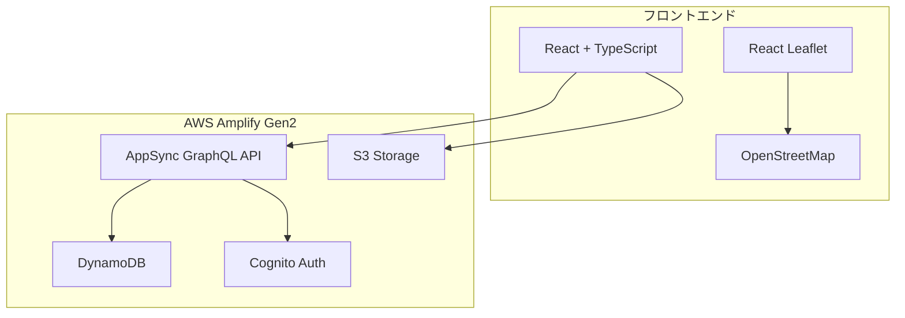

# 設計書

## 概要

マイ・ポケふたコレクションは、React + TypeScriptで構築されるモバイルファーストのWebアプリケーションです。AWS Amplify Gen2を使用してフルスタックアプリケーションとしてデプロイし、OpenStreetMapとLeafletを使用してインタラクティブなマップ機能を提供します。

## アーキテクチャ

### 全体アーキテクチャ



### 技術スタック

- **フロントエンド**: React 18 + TypeScript + Vite
- **マップライブラリ**: React Leaflet + Leaflet
- **マップタイル**: OpenStreetMap
- **バックエンド**: AWS Amplify Gen2
- **API**: AppSync GraphQL
- **データベース**: DynamoDB
- **ストレージ**: S3
- **認証**: Cognito（将来的に追加予定）
- **ホスティング**: Amplify Hosting

## コンポーネントとインターフェース

### フロントエンドコンポーネント構成

```
src/
├── components/
│   ├── Map/
│   │   ├── MapContainer.tsx      # メインマップコンポーネント
│   │   ├── PhotoMarker.tsx       # 写真マーカーコンポーネント
│   │   └── PhotoPopup.tsx        # 写真詳細ポップアップ
│   ├── Upload/
│   │   ├── PhotoUploader.tsx     # 写真アップロードコンポーネント
│   │   └── UploadProgress.tsx    # アップロード進捗表示
│   └── UI/
│       ├── LoadingSpinner.tsx    # ローディング表示
│       └── ErrorMessage.tsx      # エラーメッセージ表示
├── hooks/
│   ├── usePhotos.tsx            # 写真データ管理フック
│   ├── useUpload.tsx            # アップロード機能フック
│   └── useGeolocation.tsx       # 位置情報取得フック
├── types/
│   └── photo.ts                 # 写真データ型定義
└── utils/
    ├── exifReader.ts            # EXIF データ読み取り
    └── mapUtils.ts              # マップユーティリティ
```

### GraphQLスキーマ

```graphql
type Photo @model {
  id: ID!
  filename: String!
  s3Key: String!
  latitude: Float!
  longitude: Float!
  capturedAt: AWSDateTime!
  uploadedAt: AWSDateTime!
  thumbnailUrl: String
}

type Query {
  listPhotos: [Photo]
  getPhoto(id: ID!): Photo
}

type Mutation {
  createPhoto(input: CreatePhotoInput!): Photo
  deletePhoto(id: ID!): Photo
}
```

### 主要インターフェース

```typescript
// 写真データ型
interface Photo {
  id: string;
  filename: string;
  s3Key: string;
  latitude: number;
  longitude: number;
  capturedAt: string;
  uploadedAt: string;
  thumbnailUrl?: string;
}

// アップロード用データ型
interface PhotoUploadData {
  file: File;
  latitude: number;
  longitude: number;
  capturedAt: string;
}

// EXIF データ型
interface ExifData {
  latitude?: number;
  longitude?: number;
  dateTime?: string;
}
```

## データモデル

### DynamoDB テーブル設計

**Photo テーブル**
- **パーティションキー**: `id` (String) - UUID
- **属性**:
  - `filename` (String) - 元のファイル名
  - `s3Key` (String) - S3オブジェクトキー
  - `latitude` (Number) - 緯度（小数点以下6桁）
  - `longitude` (Number) - 経度（小数点以下6桁）
  - `capturedAt` (String) - 撮影日時（ISO 8601形式）
  - `uploadedAt` (String) - アップロード日時（ISO 8601形式）
  - `thumbnailUrl` (String, Optional) - サムネイルURL

**GSI（Global Secondary Index）**
- **GSI1**: `latitude-longitude-index`
  - 地理的範囲での効率的なクエリのため

### S3 バケット構成

```
pokefuta-photos/
├── originals/
│   └── {year}/{month}/{uuid}.{ext}    # 元画像
└── thumbnails/
    └── {year}/{month}/{uuid}_thumb.jpg # サムネイル（将来的に追加）
```

## 正確性プロパティ

*プロパティとは、システムのすべての有効な実行において真であるべき特性や動作のことです。これは、人間が読める仕様と機械で検証可能な正確性保証の橋渡しとなる形式的な記述です。*
### プロパティベーステスト用プロパティ

プロパティベーステストでは、多くの生成された入力に対して普遍的なプロパティをテストすることで、ソフトウェアの正確性を検証します。各プロパティは、すべての有効な入力に対して成り立つべき形式的な仕様です。

#### プロパティ1: GPS座標抽出の正確性
*任意の*有効なGPS情報を含む写真ファイルに対して、EXIFデータから抽出されるGPS座標は、元の撮影位置と一致する必要がある
**検証対象: 要件 1.1**

#### プロパティ2: 写真アップロードの完全性
*任意の*有効なGPS付き写真に対して、アップロード処理後にS3に画像が保存され、DynamoDBに正しいメタデータ（GPS座標、S3パス、撮影日時）が保存される必要がある
**検証対象: 要件 1.2, 1.3**

#### プロパティ3: 入力検証の正確性
*任意の*GPS情報を含まない写真ファイルに対して、システムはアップロードを拒否し、適切なエラーメッセージを表示する必要がある
**検証対象: 要件 1.4, 1.5**

#### プロパティ4: マーカー表示の完全性
*任意の*写真データセットに対して、マップ上に表示されるマーカーの数は写真の数と一致し、各マーカーは32ピクセルサイズで正しい位置に表示される必要がある
**検証対象: 要件 2.2, 2.3, 2.4**

#### プロパティ5: 写真詳細表示の正確性
*任意の*マップマーカーに対して、クリック時に表示される詳細情報（画像、撮影日時）は、対応する写真データと一致する必要がある
**検証対象: 要件 3.1, 3.2, 3.3**

#### プロパティ6: UI状態管理の一貫性
*任意の*写真詳細表示状態に対して、閉じる操作を実行するとマップ表示に戻り、ローディング状態が適切に管理される必要がある
**検証対象: 要件 3.4, 3.5**

#### プロパティ7: データ往復の一貫性
*任意の*写真メタデータに対して、AppSync GraphQL経由でDynamoDBに保存し、その後取得したデータは、元のデータと一致する必要がある
**検証対象: 要件 4.1, 4.2**

#### プロパティ8: S3 URL生成の安全性
*任意の*S3オブジェクトキーに対して、生成される署名付きURLは有効で、適切な有効期限を持つ必要がある
**検証対象: 要件 4.3**

#### プロパティ9: GPS座標精度の保持
*任意の*GPS座標に対して、保存と取得の往復処理後も、マッピングに必要な精度（小数点以下6桁）が保持される必要がある
**検証対象: 要件 4.5**

#### プロパティ10: タッチジェスチャー応答性
*任意の*有効なタッチジェスチャー（タップ、ピンチ、スワイプ）に対して、システムは適切なマップ操作で応答する必要がある
**検証対象: 要件 5.2**

#### プロパティ11: ファイル選択統合
*任意の*ファイル選択操作に対して、システムはブラウザの写真ピッカーAPIと正しく統合し、選択されたファイルを適切に処理する必要がある
**検証対象: 要件 5.3**

## エラーハンドリング

### エラー分類と対応

**1. ユーザー入力エラー**
- GPS情報なしの写真アップロード
- 無効なファイル形式
- ファイルサイズ制限超過

**対応**: 分かりやすいエラーメッセージを表示し、ユーザーに修正方法を案内

**2. ネットワークエラー**
- S3アップロード失敗
- AppSync API呼び出し失敗
- マップタイル読み込み失敗

**対応**: 自動リトライ機能と手動再試行オプションを提供

**3. システムエラー**
- EXIF読み取り失敗
- 座標変換エラー
- レンダリングエラー

**対応**: フォールバック機能とエラーログ記録

### エラーハンドリング戦略

```typescript
// エラー型定義
enum ErrorType {
  VALIDATION_ERROR = 'VALIDATION_ERROR',
  NETWORK_ERROR = 'NETWORK_ERROR',
  SYSTEM_ERROR = 'SYSTEM_ERROR'
}

interface AppError {
  type: ErrorType;
  message: string;
  details?: any;
  retryable: boolean;
}

// エラーハンドリング関数
const handleError = (error: AppError) => {
  // ログ記録
  console.error(`[${error.type}] ${error.message}`, error.details);
  
  // ユーザー向けメッセージ表示
  showUserMessage(error.message);
  
  // リトライ可能な場合はリトライオプション表示
  if (error.retryable) {
    showRetryOption();
  }
};
```

## テスト戦略

### デュアルテストアプローチ

**ユニットテスト**:
- 特定の例とエッジケースの検証
- コンポーネント単位の動作確認
- エラー条件の処理確認

**プロパティベーステスト**:
- すべての入力に対する普遍的プロパティの検証
- ランダム化による包括的な入力カバレッジ
- 正確性プロパティの自動検証

### テスト設定

**プロパティベーステストライブラリ**: fast-check (JavaScript/TypeScript用)

**テスト設定**:
- 各プロパティテストは最低100回の反復実行
- 各テストは設計ドキュメントのプロパティを参照
- タグ形式: **Feature: pokefuta-collection, Property {番号}: {プロパティテキスト}**

**ユニットテストフレームワーク**: Vitest

### テストカバレッジ目標

- **コンポーネント**: 各Reactコンポーネントの主要機能
- **フック**: カスタムフックの状態管理とAPI呼び出し
- **ユーティリティ**: EXIF読み取り、座標変換、ファイル処理
- **統合**: AWS サービスとの連携機能

### モバイルテスト戦略

- **レスポンシブデザイン**: 各画面サイズでのレイアウト確認
- **タッチ操作**: ジェスチャー応答性の確認
- **パフォーマンス**: モバイルデバイスでの動作速度確認
- **ブラウザ互換性**: Safari iOS での動作確認